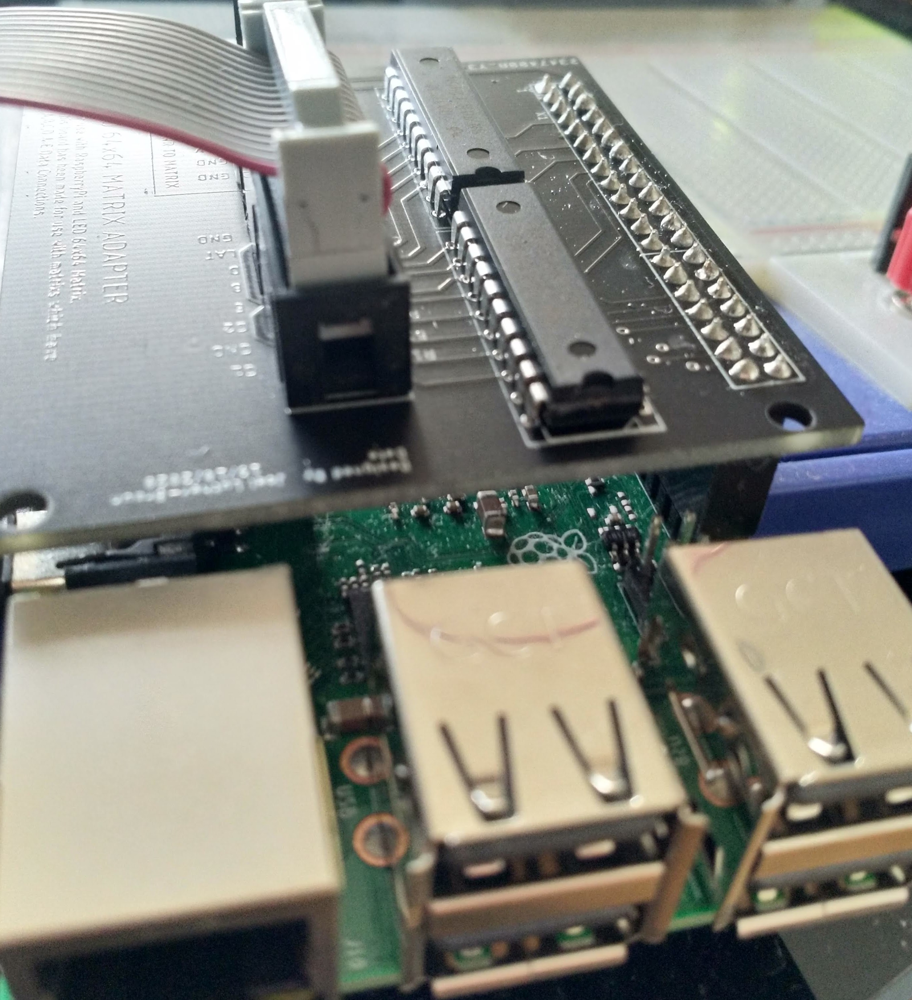
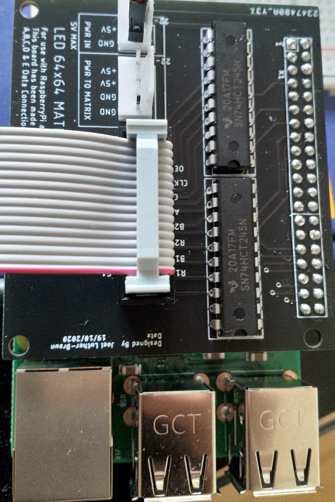
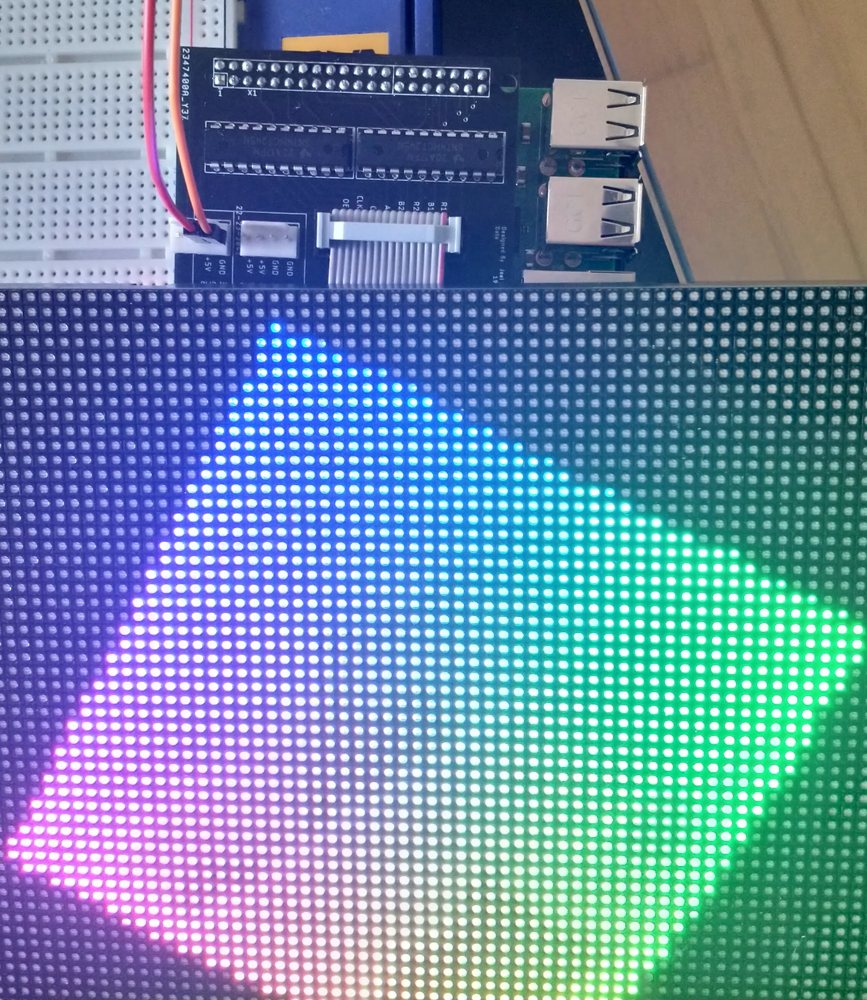

# RaspberryPi_RGB_64x64_LEDMatrix_Header

Simple Raspberry Pi 3/4 header for an RGB 64x64 LED Matrix.  
**Input 5V ONLY!** There is no voltage protection or phase protection. 
For use with LED Matrixes that have A,B,C,D & E selection pins.  
  
Components needed:  
* 2x 74HCT245N  
* 1x Molex , KK 254, 6373, 4 Way, 1 Row, Straight PCB Header, 22-23-2041  
* 1x Molex, KK 254 6373, 2 Way, 1 Row,  Straight PCB Header, 22-23-2021 (**SHOULD BE CHANGED TO CONNECTOR WITH HIGHER LOADING**)  
* 1x 40Pin Raspberry Pi PCB Header  

Connections to raspberry pi follow that of the Adadruit-PWN connection pattern:  
  
    .output_enable = GPIO_BIT(18),  /* Pins 4 and 8 are bound */  
    .clock         = GPIO_BIT(17),  
    .strobe        = GPIO_BIT(21),  
  
    .a             = GPIO_BIT(22),  
    .b             = GPIO_BIT(26),  
    .c             = GPIO_BIT(27),  
    .d             = GPIO_BIT(20),  
    .e             = GPIO_BIT(24),  
  
    .p0_r1         = GPIO_BIT(5),  
    .p0_g1         = GPIO_BIT(13),   
    .p0_b1         = GPIO_BIT(6),  
    .p0_r2         = GPIO_BIT(12),  
    .p0_g2         = GPIO_BIT(16),  
    .p0_b2         = GPIO_BIT(23),  
    
This is the reccomended libary for usage:  
https://github.com/hzeller/rpi-rgb-led-matrix    

  
Images:  

